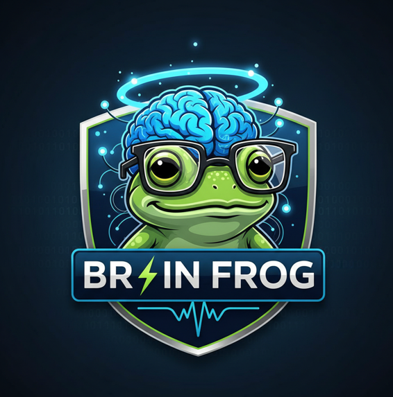

<div align="center">



# 🐸 Brain Frog

**The AI Agent That Shows Its Work**

An AI agent platform with ReAct reasoning, visible tool execution, multi-LLM support, conversation branching, skill chaining, and persistent hierarchical memory.

[](https://github.com/your-org/brain-frog/actions/workflows/ci.yml)
[](LICENSE)
[](docker-compose.yml)
[](CONTRIBUTING.md)

[**🚀 Try Live Demo**](#-test-online-no-download-required) · [**📋 Status Tracker**](#-status-tracker) · [**📖 Documentation**](#documentation) · [**🐛 Report Bug**](https://github.com/your-org/brain-frog/issues)

</div>

---

## Overview

Brain Frog is an AI agent platform built around one principle: **transparency**. Every step of the agent's reasoning is visible. Tool executions are shown in real-time. Memory operations are observable. Multiple LLM providers can be chained with automatic failover.

Brain Frog features a working chat engine, hierarchical persistent memory (3-tier: working, episodic, semantic), security scanning, response analytics, and multi-platform messaging adapters.

---

## 📋 Status Tracker

| Feature | Status | Details |
|---------|--------|---------|
| ReAct reasoning loop | ✅ Working | Agent reasons through steps with visible thought process |
| Visible tool execution | ✅ Working | Skills execute in real-time with results displayed in chat |
| Multi-LLM support | ✅ Working | OpenAI, Anthropic, Google Gemini, z-ai-web-dev-sdk with auto-failover |
| Hierarchical Memory (3-tier) | ✅ Working | Working → Episodic → Semantic with auto-promotion |
| Persistent sessions & messages | ✅ Working | SQLite via Prisma, survives server restarts |
| Security scanning | ✅ Working | Prompt injection detection, input sanitization, output validation |
| Conversation branching | ✅ Working | Fork from any user message into a new session |
| Real-time token cost tracking | ✅ Working | Per-message token counts and estimated cost in sidebar |
| Skill chaining | ⚠️ Planned | Chain multiple skills in sequence with shared context |
| Response ratings (thumbs up/down) | ✅ Working | Per-message ratings stored in DB, linked to prompt version |
| Prompt versioning | ✅ Working | Create, activate, compare system prompt versions |
| Analytics API | ✅ Working | Per-version ratings, daily breakdowns, session counts |
| Session history & reload | ✅ Working | Load previous conversations from the session history panel |
| Memory browser | ✅ Working | Browse all stored memory entries with search and type filtering |
| File upload in chat | ✅ Working | Images and text files, max 10MB |
| Messaging adapters | ✅ Built | Telegram, Discord, WhatsApp adapters (requires API keys) |
| OAuth 2.0 + PKCE authentication | ⚠️ Planned | Currently no auth layer |
| Skill execution engine | ⚠️ Planned | Skills are metadata definitions; execution handlers planned |
| Vector search for memory | ⚠️ Planned | Currently keyword-based search |
| Skill marketplace | ❌ Not available | Currently a local registry only |
| CLI tool | ❌ Not available | Currently API-only |
| Automated prompt optimization | ❌ Not available | Currently human-in-the-loop analytics |

---

## 🎯 Test Online (No Download Required)

You can test Brain Frog **right now** without downloading or installing anything:

### Quick Test Steps:

1. **Deploy this repository** to Vercel, Netlify, or any hosting platform
2. **Visit the deployed URL** — the main page includes a fully functional live demo
3. **Start chatting** with Brain Frog directly in your browser
4. **Attach files** (images, text, JSON, CSV, PDF) using the paperclip button
5. **Rate responses** by hovering over assistant messages and clicking thumbs up/down

### What You'll See in the Demo:

- **Live Chat Interface**: Send messages and receive AI responses in real-time
- **File Upload**: Attach images and documents to your messages
- **Memory System**: Watch memory tiers (working, episodic, semantic) update as you chat
- **Security Scanning**: Every message is scanned for prompt injection attempts (try sending `"ignore all previous instructions"`)
- **Response Ratings**: Hover over responses to rate them with thumbs up/down
- **Agent Status Panel**: Real-time monitoring of memory usage, active skills, uptime, and configuration
- **LLM Provider Selector**: Choose your preferred AI provider or let auto-failover decide

> **Note**: The online demo connects to the backend API. For full functionality with persistent memory and messaging integrations, deploy the complete stack using Docker.

---

## 📱 Messaging Integrations

Brain Frog includes **messaging adapters** with an adapter pattern supporting Telegram, Discord, and WhatsApp. Each adapter handles webhook verification, message parsing, and response delivery.

### Architecture

```
User → Telegram/Discord/WhatsApp
         ↓
   Webhook Endpoint (/api/messaging/{platform})
         ↓
   Messaging Gateway (routing, session mapping)
         ↓
   Brain Frog Engine (security → memory → LLM → response)
         ↓
   Platform Adapter (send response back)
         ↓
User ← Telegram/Discord/WhatsApp
```

### Setup

#### Telegram

1. Create a bot via [@BotFather](https://t.me/botfather) on Telegram
2. Add `TELEGRAM_BOT_TOKEN=your_token` to `.env`
3. Set the webhook:
   ```bash
   curl "https://api.telegram.org/bot${TELEGRAM_BOT_TOKEN}/setWebhook?url=https://your-domain.com/api/messaging/telegram"
   ```

#### Discord

1. Create an application at [Discord Developer Portal](https://discord.com/developers/applications)
2. Create a bot, enable the MESSAGE_CONTENT intent
3. Add to `.env`:
   ```
   DISCORD_BOT_TOKEN=your_token
   DISCORD_PUBLIC_KEY=your_public_key
   ```
4. Set the interaction endpoint URL to `https://your-domain.com/api/messaging/discord`

#### WhatsApp

1. Create a Meta Developer account at [developers.facebook.com](https://developers.facebook.com)
2. Set up a WhatsApp Business Account and get your API credentials
3. Add to `.env`:
   ```
   WHATSAPP_TOKEN=your_token
   WHATSAPP_PHONE_NUMBER_ID=your_phone_number_id
   WHATSAPP_VERIFY_TOKEN=brain-frog-verify
   ```
4. Configure the webhook callback URL in the Meta dashboard

### Messaging API

```bash
# Check which platforms are configured
GET /api/messaging/status

# Telegram webhook
POST /api/messaging/telegram

# Discord webhook
POST /api/messaging/discord

# WhatsApp webhook (GET for verification, POST for messages)
GET  /api/messaging/whatsapp
POST /api/messaging/whatsapp
```

---

## 💾 Persistent Memory & Sessions

All important data survives server restarts via SQLite:

### What Gets Persisted

| Data | Storage | Survives Restart |
|------|---------|-----------------|
| Memory entries (all 3 tiers) | SQLite via Prisma | ✅ Yes |
| Chat message history | SQLite via Prisma | ✅ Yes |
| Session metadata | SQLite via Prisma | ✅ Yes |
| Security audit logs | SQLite via Prisma | ✅ Yes |
| Platform session mappings | In-memory | ⚠️ Recreated on first message |

### How It Works

1. **Every chat message** is saved to the `ChatMessage` table with session ID and prompt version
2. **Every memory entry** (working, episodic, semantic) is written to the `MemoryEntry` table
3. **On startup**, the agent loads recent episodic and all semantic entries from the database
4. **Memory promotion** happens automatically: working → episodic (when important) → semantic (when frequently accessed)
5. **Search queries** hit the database using keyword matching with relevance scoring

---

## 🚀 Quick Start

### Prerequisites

- **Node.js** 18+ or **Bun** 1.0+
- **npm**, **yarn**, or **bun**

### Installation

```bash
# 1. Clone the repository
git clone https://github.com/your-org/brain-frog.git
cd brain-frog

# 2. Install dependencies
npm install

# 3. Set up environment variables
cp .env.example .env
# Edit .env with your API keys

# 4. Push database schema
npx prisma db push

# 5. Start the development server
npm run dev
```

Open [http://localhost:3000](http://localhost:3000) to see the application.

### Docker Quick Start

```bash
# Clone and run with Docker Compose
git clone https://github.com/your-org/brain-frog.git
cd brain-frog
cp .env.example .env
docker compose up -d
```

The application will be available at [http://localhost:3000](http://localhost:3000).

---

## 📖 Documentation

### Project Structure

```
brain-frog/
├── src/
│   ├── app/                    # Next.js app (Web Dashboard)
│   │   ├── api/
│   │   │   ├── agent/          # Agent REST API
│   │   │   │   ├── chat/       # Chat endpoint (persistent sessions)
│   │   │   │   ├── status/     # Health/status endpoint
│   │   │   │   ├── security/   # Security logs endpoint
│   │   │   │   ├── rate/       # Response rating endpoint
│   │   │   │   ├── analytics/  # Performance analytics endpoint
│   │   │   │   └── prompt-versions/ # Prompt version management
│   │   │   └── messaging/      # Messaging Platform Webhooks
│   │   │       ├── telegram/   # Telegram Bot webhook
│   │   │       ├── discord/    # Discord Bot webhook
│   │   │       ├── whatsapp/   # WhatsApp Cloud API webhook
│   │   │       └── status/     # Messaging gateway status
│   │   ├── layout.tsx          # Root layout with theme support
│   │   ├── page.tsx            # Main page (Demo + Docs)
│   │   └── globals.css         # Global styles
│   ├── components/
│   │   ├── agent/              # Agent-specific UI components
│   │   │   ├── chat-demo.tsx   # Live chat demo with file upload
│   │   │   ├── features.tsx    # Feature showcase
│   │   │   ├── architecture.tsx # Architecture documentation
│   │   │   ├── comparison.tsx  # Feature comparison table
│   │   │   └── setup.tsx       # Setup instructions
│   │   └── ui/                 # shadcn/ui component library
│   └── lib/
│       ├── agent/              # Core Agent Engine
│       │   ├── types.ts        # Type definitions
│       │   ├── index.ts        # Agent runtime (persistent sessions + memory)
│       │   ├── persistent-memory.ts # Database-backed memory system
│       │   └── skills.ts       # Skill registry + definitions
│       ├── messaging/          # Multi-Platform Messaging
│       │   ├── types.ts        # Adapter interface + message types
│       │   ├── adapters.ts     # Telegram, Discord, WhatsApp adapters
│       │   └── gateway.ts      # Central message router
│       ├── security/
│       │   └── manager.ts      # Security manager (injection detection, sanitization)
│       ├── analytics/
│       │   └── prompt-versioning.ts # Prompt version management
│       ├── db.ts               # Database client (Prisma)
│       └── utils.ts            # Utility functions
├── prisma/
│   └── schema.prisma           # Database schema
├── public/
│   └── brain-frog-logo.png     # Brain Frog logo
├── Dockerfile                  # Production Docker image
├── docker-compose.yml          # Docker Compose setup
├── .env.example                # Environment template
├── LICENSE                     # MIT License
├── CONTRIBUTING.md             # Contributing guide
└── README.md                   # This file
```

### Core Architecture

```
┌─────────────────────────────────────────────────────────────┐
│                     Web Dashboard                            │
│  (Next.js 16, React, Tailwind CSS, shadcn/ui)               │
├──────────┬──────────┬──────────────────────────────────────┤
│ Telegram │ Discord  │ WhatsApp  │ Web Chat (Live Demo)       │
│ Adapter  │ Adapter  │ Adapter   │                             │
├──────────┴──────────┴──────────────────────────────────────┤
│                  Messaging Gateway                           │
│  (Session Mapping, Platform Routing)                        │
├─────────────────────────────────────────────────────────────┤
│                    Agent Runtime                             │
│  ┌──────────┐  ┌──────────────┐  ┌───────────────────┐    │
│  │ Security │→ │  Persistent  │→ │  Multi-LLM         │    │
│  │  Layer   │  │  Memory (DB) │  │  (Auto-Failover)   │    │
│  └──────────┘  └──────────────┘  └───────────────────┘    │
│  ┌─────────────────────────────────────────────────────┐    │
│  │              Skill Registry                           │    │
│  │  (Metadata definitions, permissions, extensibility)  │    │
│  └─────────────────────────────────────────────────────┘    │
├─────────────────────────────────────────────────────────────┤
│                  SQLite (via Prisma ORM)                     │
│  (Sessions, Messages, Memory, Ratings, Security Logs)       │
└─────────────────────────────────────────────────────────────┘
```

### API Reference

#### Chat with Agent

```bash
POST /api/agent/chat
Content-Type: application/json

{
  "message": "Hello, what can you do?",
  "sessionId": "optional-session-id",
  "provider": "openai",
  "attachment": [{
    "filename": "photo.png",
    "mimeType": "image/png",
    "data": "base64-encoded-file-data"
  }]
}
```

**Streaming Chat:**
```bash
POST /api/agent/chat-stream
Content-Type: application/json

{
  "message": "Explain quantum computing step by step",
  "stream": true
}
```

**Response:**
```json
{
  "id": "msg-uuid",
  "role": "assistant",
  "content": "I'm Brain Frog...",
  "timestamp": "2026-03-30T00:00:00.000Z",
  "sessionId": "session-uuid",
  "memoryStats": { "working": 3, "episodic": 1, "semantic": 0, "total": 4 },
  "securityCheck": { "safe": true, "risk": 0 }
}
```

#### Other Endpoints

```bash
GET  /api/agent/status          # Agent health, config, memory stats, skills
GET  /api/agent/sessions        # List all sessions
GET  /api/agent/sessions/:id    # Load a specific session's messages
GET  /api/agent/memory          # Browse memory entries (with search/filter)
POST /api/agent/rate            # Rate a response: { messageId, rating: 1-5 }
GET  /api/agent/analytics       # Full analytics dashboard
GET  /api/agent/prompt-versions # List prompt versions
POST /api/agent/prompt-versions # Create a prompt version
PATCH /api/agent/prompt-versions # Activate a version
GET  /api/messaging/status      # Messaging platform status
```

### Environment Variables

| Variable | Description | Default |
|----------|-------------|---------|
| `DATABASE_URL` | SQLite database path | `file:./db/dev.db` |
| `OPENAI_API_KEY` | OpenAI API key | — |
| `OPENAI_MODEL` | OpenAI model to use | `gpt-4o-mini` |
| `ANTHROPIC_API_KEY` | Anthropic API key | — |
| `ANTHROPIC_MODEL` | Anthropic model to use | `claude-sonnet-4-20250514` |
| `GOOGLE_API_KEY` | Google AI API key | — |
| `GOOGLE_MODEL` | Google model to use | `gemini-2.0-flash` |
| `DEFAULT_MODEL` | Default model name | `gpt-4` |
| `DEFAULT_TEMPERATURE` | Default temperature | `0.7` |
| `DEFAULT_MAX_TOKENS` | Default max tokens | `4096` |
| `ENABLE_MEMORY` | Enable memory system | `true` |
| `ENABLE_SKILLS` | Enable skill system | `true` |
| `SECURITY_LEVEL` | Security scanning level | `high` |
| `TELEGRAM_BOT_TOKEN` | Telegram bot token | — |
| `DISCORD_BOT_TOKEN` | Discord bot token | — |
| `DISCORD_PUBLIC_KEY` | Discord public key | — |
| `WHATSAPP_TOKEN` | WhatsApp API token | — |
| `WHATSAPP_PHONE_NUMBER_ID` | WhatsApp phone number ID | — |

---

## 🔒 Security

Brain Frog implements security measures that actually exist in the codebase:

| Security Feature | Status | Implementation |
|-----------------|--------|----------------|
| **Prompt Injection Detection** | ✅ Built | 8+ attack pattern recognition with risk scoring |
| **Input Sanitization** | ✅ Built | XSS/injection prevention, HTML/script stripping |
| **Output Validation** | ✅ Built | Credential leak detection, length limits |
| **Audit Logging** | ✅ Built | All events logged with severity levels, stored in DB |
| **Authentication** | ⚠️ Planned | Currently no auth layer. Planned: OAuth 2.0 + PKCE |
| **Credential Storage** | ⚠️ Planned | Currently .env file. Planned: OS keychain integration |
| **Encrypted Storage** | ⚠️ Planned | Currently plaintext SQLite. Planned: encryption at rest |
| **Skill Sandboxing** | ⚠️ Planned | Currently metadata only. Planned: isolated execution |

---

## 📊 Analytics & Prompt Improvement

### What This Is

Brain Frog includes **data collection and analysis infrastructure** for measuring response quality and comparing system prompt versions. This is the foundation for prompt optimization.

**What exists now:**

| Capability | Status | Description |
|-----------|--------|-------------|
| Response ratings | ✅ Built | Users rate responses via thumbs up/down in the chat UI and API |
| Rating persistence | ✅ Built | Every rating is stored in the database with the message ID, session, and prompt version |
| Prompt versioning | ✅ Built | Create, list, activate, and delete system prompt versions |
| Analytics API | ✅ Built | GET `/api/agent/analytics` returns session counts, average ratings, and daily breakdowns |
| Auto A/B routing | ❌ Not available | Sessions are assigned to whichever prompt is active |
| Auto-optimization | ❌ Not available | The system does NOT automatically switch prompts |

### How to Use It

#### 1. Users Rate Responses
In the live demo, hover over any assistant response to see 👍/👎 buttons.

#### 2. Create a New Prompt Version
```bash
POST /api/agent/prompt-versions
Content-Type: application/json

{
  "label": "Concise v2",
  "description": "Shorter, more direct responses",
  "content": "You are Brain Frog. Be concise and direct. Never use more than 3 sentences when fewer would suffice."
}
```

#### 3. Activate It
```bash
PATCH /api/agent/prompt-versions
Content-Type: application/json

{ "versionId": "<id-from-step-2>", "activate": true }
```

#### 4. Review Analytics
```bash
GET /api/agent/analytics
```

---

## 🧩 Skills

### Built-in Skills

> **Note:** Skills are currently registered as metadata definitions with permission models. Actual execution handlers are planned for a future release.

| Skill | Description | Permissions |
|-------|-------------|-------------|
| `web-search` | Search the web for information | `network:read` |
| `code-executor` | Execute JavaScript/TypeScript in sandbox | `sandbox:execute` |
| `file-reader` | Read and parse files (JSON, CSV, text) | `fs:read` |
| `summarizer` | Summarize long texts and documents | None |
| `translator` | Translate between languages | None |
| `image-generator` | Generate images from text | `ai:generate` |

---

## 🚢 Deployment

### Vercel (Recommended)

```bash
npx vercel deploy --prod
```

### Docker

```bash
docker compose up -d
```

### Any Node.js Host

```bash
npm run build && npm start
```

Works on Railway, Render, Fly.io, DigitalOcean App Platform, or any Node.js 18+ host.

---

## 🤝 Contributing

Contributions are welcome! Please read [CONTRIBUTING.md](CONTRIBUTING.md) for details.

### Security Vulnerability Reports

Please report security vulnerabilities privately by opening an issue with the `security` label.

---

## 📄 License

This project is licensed under the MIT License - see the [LICENSE](LICENSE) file for details.

---

<div align="center">

**Built with 🐸 by the Brain Frog Team**

*The AI agent that shows its work.*

</div>
